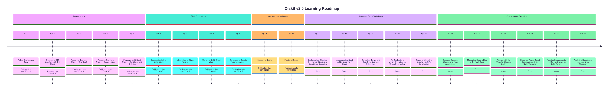

# Mastering Qiskit v2.0 – From Fundamentals to Hardware

**Author:** Ricard Santiago Raigada García
**Status:** Active

**Citation:** To cite this course you can use the following DOI:

[](https://doi.org/10.5281/zenodo.16872377)

---

## 📖 About this Course

**Mastering Qiskit v2.0** is a complete learning series designed to take you from the very basics of quantum circuits to running optimized workloads on IBM Quantum hardware.
The course is based on the latest **Qiskit v2.0** SDK and IBM Quantum Platform updates.

This repository contains:

- All course materials (notebooks, code, and visual assets)
- The official episode roadmap
- Example circuits and visualizations
- Ready-to-run Qiskit v2.0 code

---

## 🎯 Learning Goals

By the end of this series, you will be able to:

- Set up your environment and connect to IBM Quantum hardware
- Prepare and manipulate quantum states
- Use the Qiskit SDK effectively for building and optimizing circuits
- Apply measurement strategies and visualize results
- Implement advanced circuit techniques
- Work with operators, observables, and execution primitives
- Run jobs on real hardware and apply error mitigation

---

## 📂 Repository Structure

```plain
Mastering-Qiskit-v2.0/
│
├── fundamentals/
│   ├── ep1-python-env-setup/
│   ├── ep2-connect-ibm-cloud/
│   ├── ep3-preparing-states-one-qubit/
│   ├── ep4-preparing-superposition/
│   └── ep5-preparing-multiqubit-bell/
│
├── qiskit-foundations/
│   ├── ep6-intro-qiskit-stack/
│   ├── ep7-intro-qiskit-patterns/
│   ├── ep8-using-circuit-library/
│   └── ep9-constructing-circuits/
│
├── measurement-and-gates/
│   ├── ep10-measuring-qubits/
│   └── ep11-fractional-gates/
│
├── advanced-circuit-techniques/
│   ├── ep12-classical-feedforward/
│   ├── ep13-bit-ordering/
│   ├── ep14-timing-and-stretch/
│   ├── ep15-resynthesizing-unitaries/
│   └── ep16-saving-circuits-qpy/
│
├── operators-and-execution/
│   ├── ep17-operator-classes/
│   ├── ep18-measuring-pauli-basis/
│   ├── ep19-operator-class-in-depth/
│   ├── ep20-hardware-aware-optimization/
│   ├── ep21-running-on-hardware/
│   └── ep22-analyzing-results-error-mitigation/
│
├── qml/                       # (Future topic)
├── vqe/                       # (Future topic)
├── assets/                    # Logos, banners, roadmap
├── README.md
└── requirements.txt
```

---

## 📅 Roadmap – Current Phase



---

## 📜 Episode List

| #   | Episode Title                                                   | Status       | Date       |
|-----|-----------------------------------------------------------------|--------------|------------|
| 1   | Python Environment Setup                                        | Released     | 08/07/2025 |
| 2   | Connect to IBM Quantum with IBM Cloud                           | Released     | 08/08/2025 |
| 3   | Preparing Quantum States – One Qubit                            | Released     | 08/09/2025 |
| 4   | Preparing Quantum States – Superposition                        | Released     | 08/10/2025 |
| 5   | Preparing Multi-Qubit States – Bell States and Ordering         | Released     | 08/11/2025 |
| 6   | Introduction to the Qiskit Stack                                | Released     | 08/13/2025 |
| 7   | Introduction to Qiskit Patterns                                 | Released     | 08/15/2025 |
| 8   | Using the Qiskit Circuit Library                                | Released     | 08/18/2025 |
| 9   | Constructing Circuits Programmatically                          | Released     | 08/20/2025 |
| 10  | Measuring Qubits                                                 | Released    | 08/22/2025 |
| 11  | Fractional Gates                                                 | Released    | 08/25/2025 |
| 12  | Implementing Classical Feedforward Logic and Conditional Execution | Soon     | 08/27/2025    |
| 13  | Understanding Qubit and Bit Ordering in Qiskit                  | Soon         | 08/29/2025   |
| 14  | Controlling Timing and Stretch for Quantum Scheduling           | Soon         | 09/01/2025   |
| 15  | Re-Synthesizing Unitary Operators for Circuit Optimization      | Soon         | 09/03/2025  |
| 16  | Saving and Loading Circuits with QPY Serialization              | Soon         | 09/05/2025 |
| 17  | Exploring Operator Classes and Their Applications               | Soon         | 09/08/2025 |
| 18  | Measuring Observables in the Pauli Basis                        | Soon         | 09/10/2025 |
| 19  | Working with the Operator Class in Depth                        | Soon         | 09/12/2025 |
| 20  | Hardware-Aware Circuit Optimization with the Qiskit Transpiler  | Soon         | 09/15/2025 |
| 21  | Running Quantum Jobs on IBM Hardware with Qiskit Runtime        | Soon         | 09/17/2025  |
| 22  | Analyzing Results and Applying Error Mitigation                 | Soon         | 09/19/2025 |

---

## 🚀 Future Topics

After Episode 22, the series will continue with more advanced topics:

- Quantum Machine Learning (QML)
- Variational Quantum Eigensolver (VQE)
- Quantum algorithms (Grover, Shor, QAOA, VQE)
- Error correction and mitigation techniques

---

## 📜 Educational Program

This course follows a structured educational program that outlines the complete Phase 1 learning plan, including:

- A detailed description of the course scope and structure.
- Specific learning objectives for each phase.
- Competencies and skills to be acquired.
- Teaching methodology and delivery mode.
- Assessment and self-evaluation criteria.

You can consult the full educational program here:

[📄 View Educational Program (PDF)](assets/Mastering_Qiskit_v2_0___Phase_1_Curriculum.pdf)

---

## 📢 Stay Updated

Episodes are published daily on:

- **LinkedIn**: [Ricard Santiago Raigada García](https://www.linkedin.com/in/ricard-santiago-raigada-garc%C3%ADa/)
- **GitHub**: This repository

---
