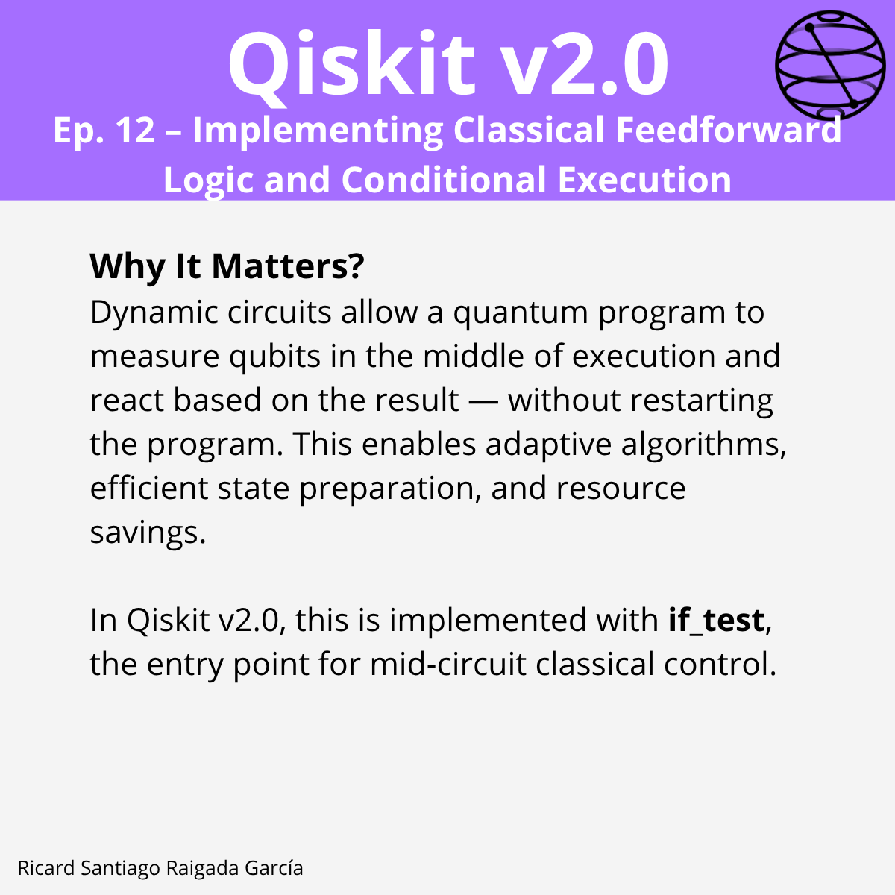

# Ep. 12: Implementing Classical Feedforward Logic and Conditional Execution

This episode covers how to implement **dynamic circuits** in Qiskit v2.0, enabling mid-circuit measurements and classical feedforward to control subsequent quantum operations without restarting the circuit. This allows adaptive algorithms, efficient state preparation, and resource optimization.

## 🎯 Learning goals

- Understand the concept of dynamic circuits and why they matter.  
- Perform mid-circuit measurements and use results for conditional execution.  
- Implement single-bit, multi-bit, and full-register conditions with `if_test`.  
- Add `else` branches using the context manager pattern.  
- Build classical expressions for custom conditions (e.g., parity checks).  
- Combine multiple conditional styles into reusable patterns.  
- Recognize Qiskit Runtime limitations for dynamic circuits.  
- Apply best practices to minimize latency and maximize clarity.  

---

## 📁 Assets

The **LinkedIn carousel** for this episode is available in the [images/](images/) folder.

---

**Next episode:** Episode 13 — Understanding Qubit and Bit Ordering
