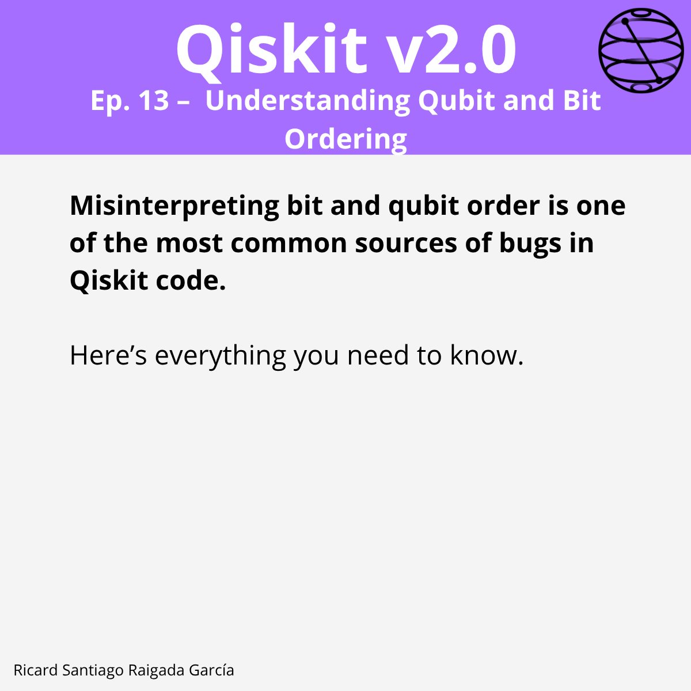

# Ep. 13: Understanding Qubit and Bit Ordering

This episode covers how qubit and bit ordering works in Qiskit, the difference between internal indexing, diagram ordering, and measurement string representation — and why misunderstanding this is one of the most common sources of bugs in Qiskit code.

## 🎯 Learning goals

- Understand how Qiskit internally indexes qubits in a `QuantumCircuit`.
- Recognize how diagram ordering differs from internal indexing.
- Interpret bit significance in integers (LSB vs MSB).
- Correctly read and interpret measurement strings.
- Relate statevector indices to computational basis states.
- Apply controlled gate conventions consistently.
- Know the difference between reversing diagram order and reversing logical qubit order.

---

## 📁 Assets

The **LinkedIn carousel** for this episode is available in the [images/](images/) folder.

---

**Next episode:** Episode 14 — Working with Qiskit’s Measurement and Result Objects
