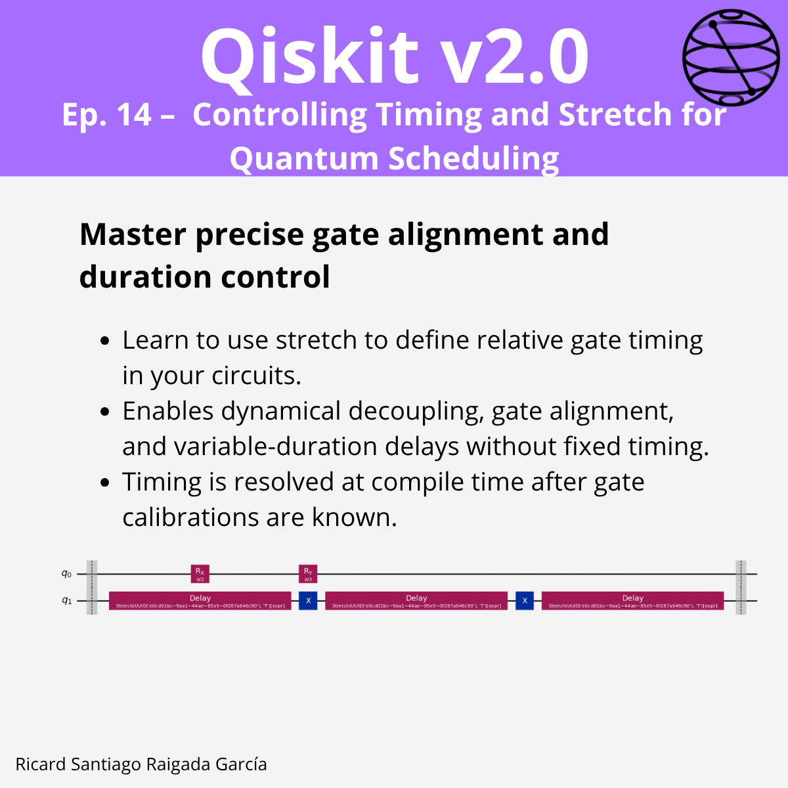

# Ep. 14: Controlling Timing and Stretch for Quantum Scheduling

This episode covers how to master precise gate alignment and duration control in Qiskit using the `stretch` feature for quantum scheduling, enabling relative gate timing without hardcoding exact delays.

## 🎯 Learning goals

- Understand how `stretch` defines relative gate timing in circuits.
- Learn why `stretch` matters for dynamical decoupling, echo sequences, and gate alignment.
- Use the basic syntax for adding and manipulating stretch variables.
- Apply `stretch` in practical examples, such as dynamical decoupling alignment.
- Explore automatic left alignment between barriers.
- Recognize valid and invalid stretch usage rules.
- Identify Qiskit Runtime limitations for stretch.

---

## 📁 Assets

The **LinkedIn carousel** for this episode is available in the [images/](images/) folder.

---

**Next episode:** Episode 15 — Re-Synthesizing Unitary Operators for Circuit Optimization
