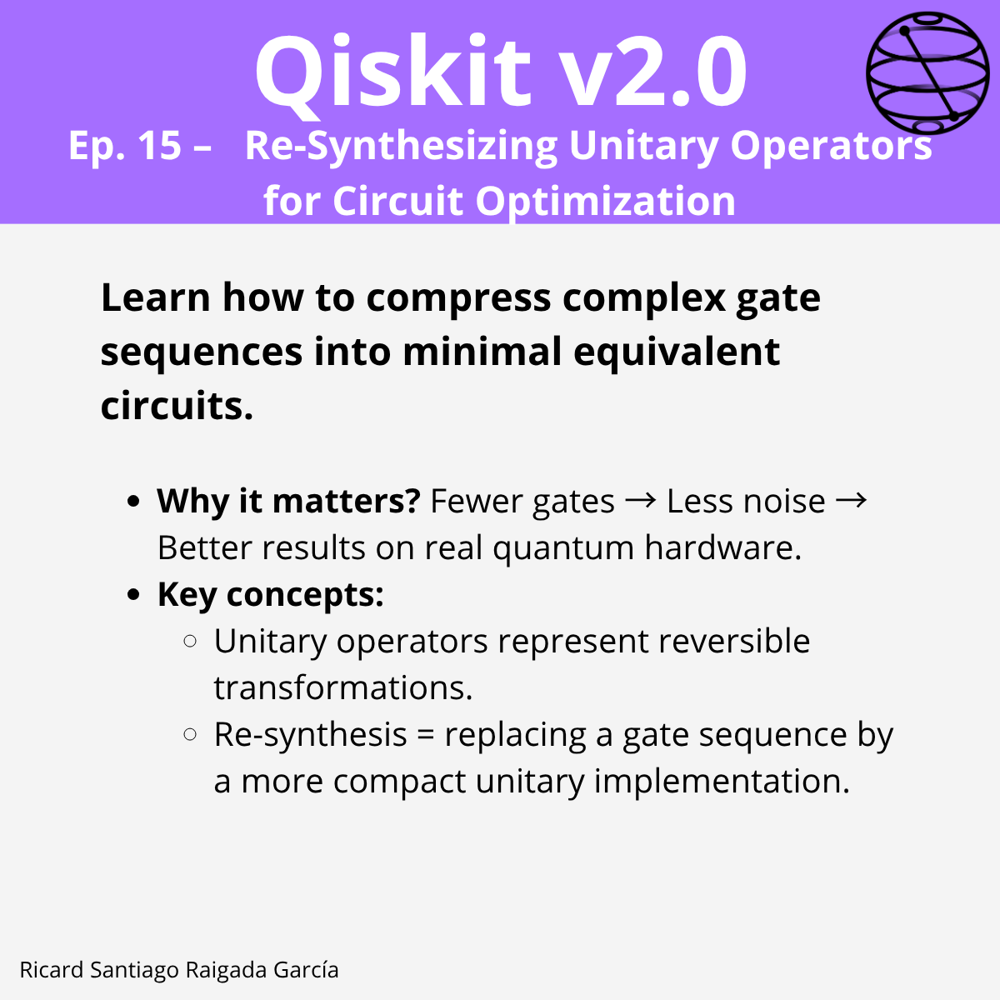

# Ep. 15: Re-Synthesizing Unitary Operators for Circuit Optimization

This episode covers how to compress complex quantum gate sequences into minimal equivalent circuits by re-synthesizing unitary operators, reducing noise and execution time for better performance on real quantum hardware.

## 🎯 Learning goals

- Understand what a unitary operator is and its role in quantum circuits.
- Learn why re-synthesis can optimize circuits by removing redundant or suboptimal gate sequences.
- Identify benefits of re-synthesis such as reducing two-qubit gates and lowering circuit depth.
- Apply techniques to collapse complex gate sequences into simpler forms.
- Use Qiskit's `transpile` function for automatic optimization and re-synthesis.
- Follow a practical workflow for validating and applying re-synthesized circuits on hardware.
- Recognize trade-offs between compile time and runtime performance.

---

## 📁 Assets

The **LinkedIn carousel** for this episode is available in the [images/](images/) folder.

---

**Next episode:** Episode 16 — Saving and Loading Circuits with QPY Serialization
