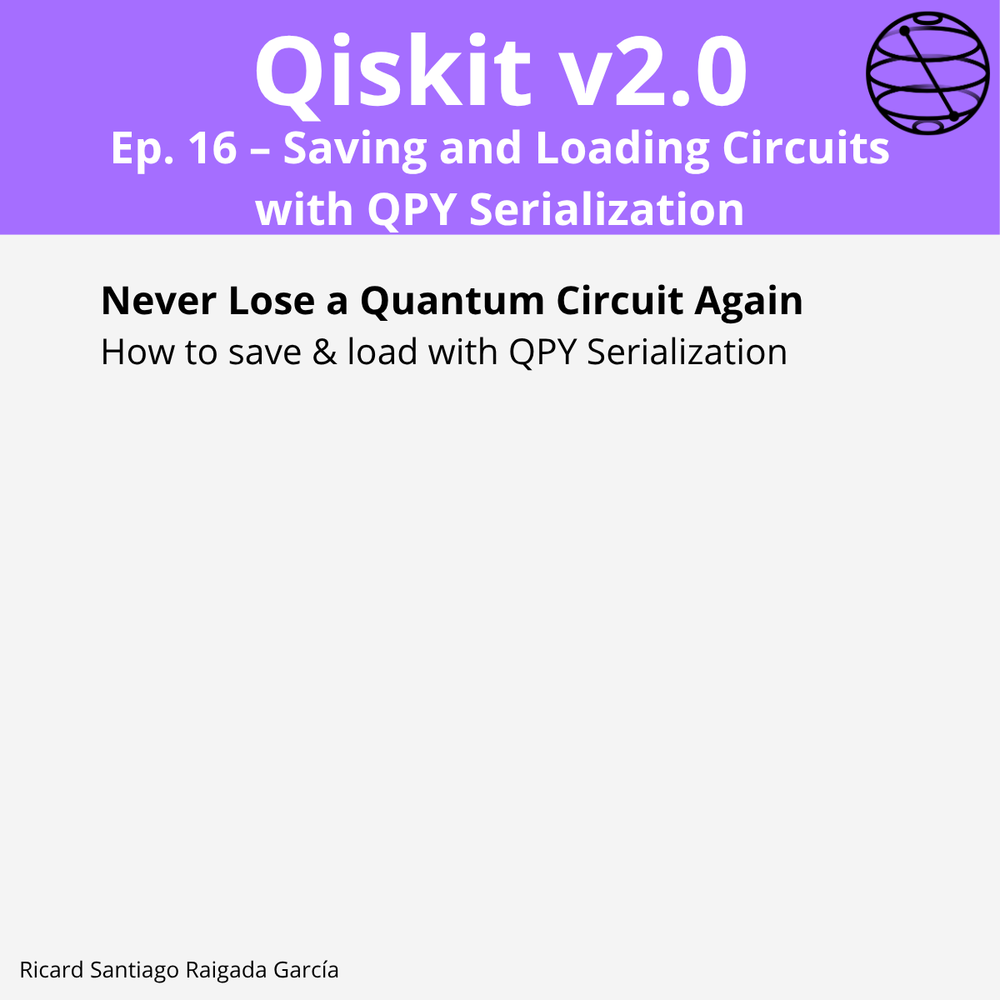

# Episode 16 — Saving and Loading Circuits with QPY Serialization

**This episode covers** how to persist complete `QuantumCircuit` objects to disk using Qiskit’s **QPY binary serialization format**, ensuring full metadata preservation, forward compatibility across Qiskit versions, and safe circuit sharing between environments.

## 🎯 Learning goals

- Understand the purpose and advantages of the QPY format over OpenQASM and pickle.
- Save single or multiple quantum circuits into a `.qpy` file.
- Load QPY files back into Python and restore the exact `QuantumCircuit` object.
- Verify unitary equivalence before and after serialization to ensure integrity.
- Apply compression (`.qpy.gz`) for storage efficiency.
- Check QPY format version compatibility with `qpy.get_qpy_version`.

---

## 📁 Assets

The **LinkedIn carousel** for this episode is available in the `images/` folder.

---

**Next episode:** Episode 17 — Exploring Operator Classes and Their Applications
