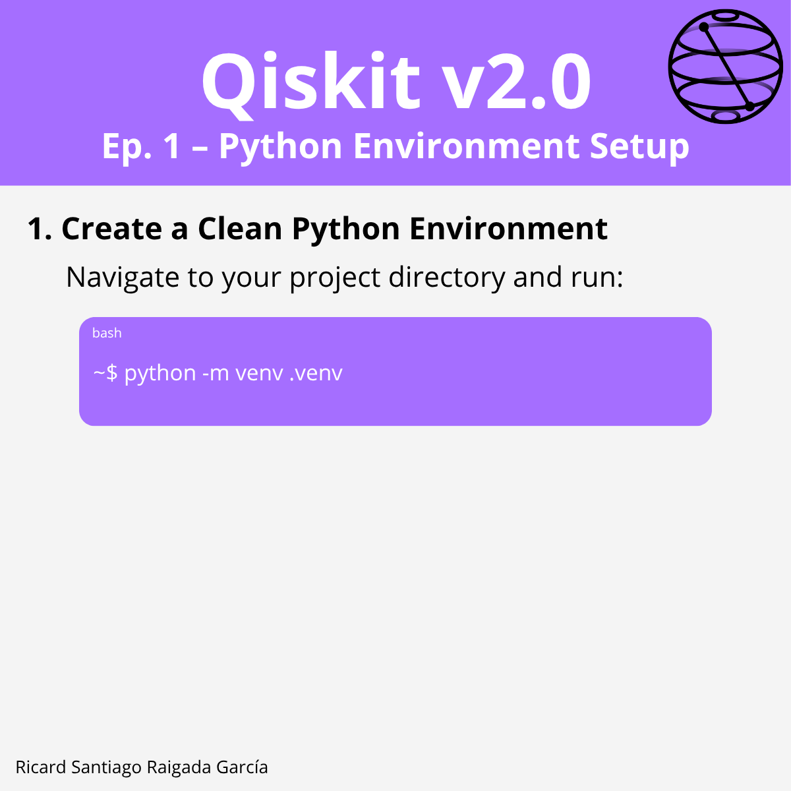

# Episode 1 – Python Environment Setup

This episode covers **how to install Qiskit v2.0 cleanly** without cluttering your system, ensuring your environment is isolated, reproducible, and ready for future episodes of this course.

## 🎯 Learning goals

- Create an isolated Python environment for Qiskit v2.0
- Install the Qiskit SDK with optional packages
- Enable visualization features
- Set up Jupyter notebooks for interactive quantum programming

---

## 📁 Assets

The **LinkedIn carousel** for this episode (installation guide) is available in the [`images/`](images/) folder.

---

**Next episode:** [Episode 2 – Connect to IBM Quantum with IBM Cloud](../ep2-connect-ibm-cloud/README.md)
