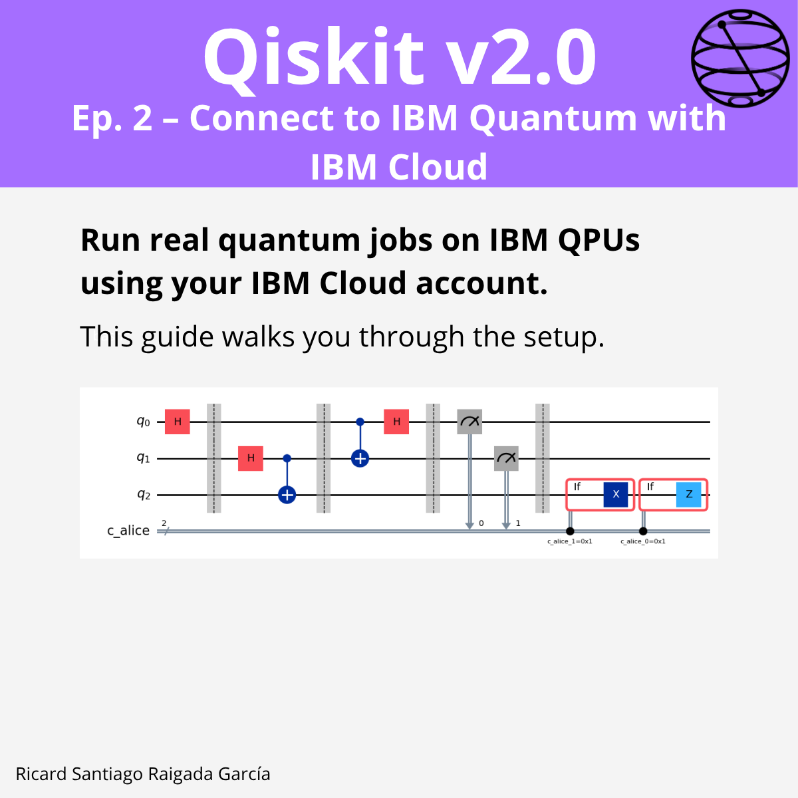

# Episode 2 — Connect to IBM Quantum with IBM Cloud

**This episode covers** creating and configuring your IBM Cloud + IBM Quantum account, generating an API token and (optional) CRN, saving credentials with `QiskitRuntimeService.save_account()`, initializing the service, listing devices, and submitting a minimal job to a real backend using the Runtime `Sampler`.

## 🎯 Learning goals

- Create a Quantum **instance** and understand regions/plans.
- Generate and securely store your **API token** (and CRN).
- Save credentials locally with `QiskitRuntimeService.save_account()`.
- Initialize the Runtime service and **list backends**.
- Run a tiny **hardware job** (Bell state sampling) via Runtime.

---

## 📁 Assets

The **LinkedIn carousel** for this episode is available in the `images/` folder.

---

**Next episode:** Episode 3 — Preparing Quantum States: One Qubit
