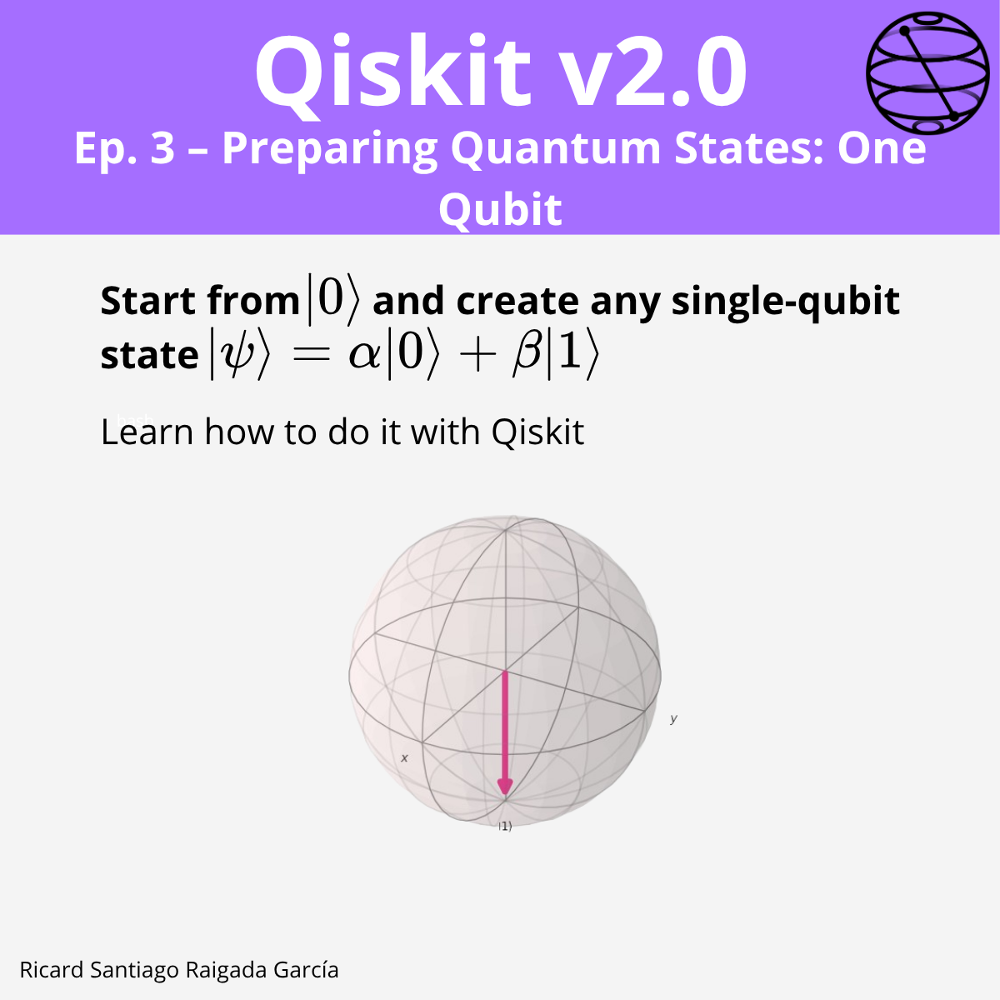

# Episode 3 — Preparing Quantum States: One Qubit

**This episode covers** how to start from the base state $|0\rangle$ and create any single-qubit state $|\psi\rangle = \alpha|0\rangle + \beta|1\rangle$, using both the X gate and arbitrary rotations, and how to visualize states in the Bloch sphere.

## 🎯 Learning goals

- Understand **Dirac notation** for one-qubit states.
- Use the **X gate** to swap $|0\rangle$ and $|1\rangle$.
- Represent the X gate as a matrix and understand its effect.
- Implement gates in Qiskit with `QuantumCircuit`.
- Visualize quantum states with `plot_bloch_multivector`.
- Prepare arbitrary one-qubit states using **rotations**.

---

## 📁 Assets

The **LinkedIn carousel** for this episode is available in the `images/` folder.

---

**Next episode:** Episode 4 — Preparing Quantum States: Multiple Qubits
