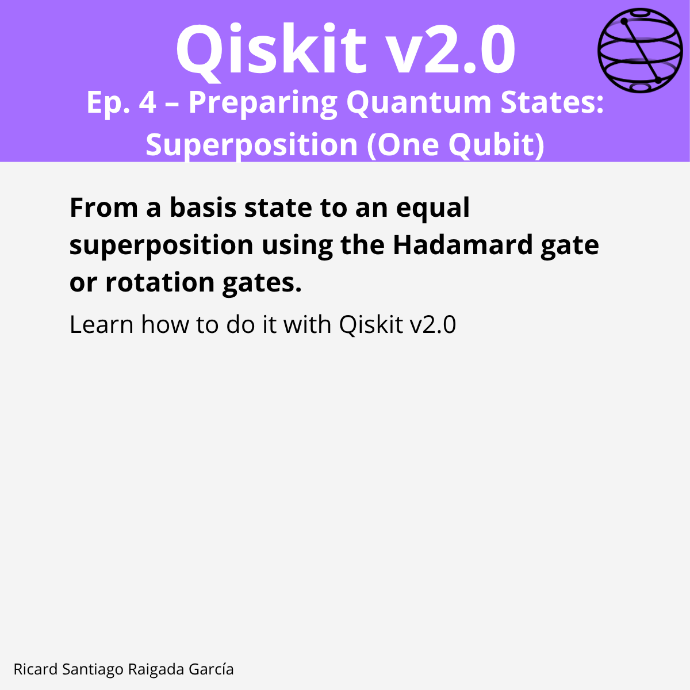

# Episode 4 — Preparing Quantum States: Superposition (One Qubit)

**This episode covers** how to take the initialized state $|0\rangle$ to an equal superposition $ (|0\rangle + |1\rangle)/\sqrt{2}$ using either the **Hadamard** gate or a **$R_y(\pi/2)$** rotation, and how to visualize and verify the result.

## 🎯 Learning goals

- Understand the target **equal superposition** state.
- Prepare it with **Hadamard** and with **rotations**.
- Visualize states on the **Bloch sphere**.
- Verify numerical equivalence of both methods.
- (Optional) Simulate measurements and inspect **counts**.

---

## 📁 Assets

The **LinkedIn carousel** for this episode is available in the `images/` folder.

---

**Next episode:** Episode 5 — Preparing Multi‑Qubit States: Bell States and Ordering
