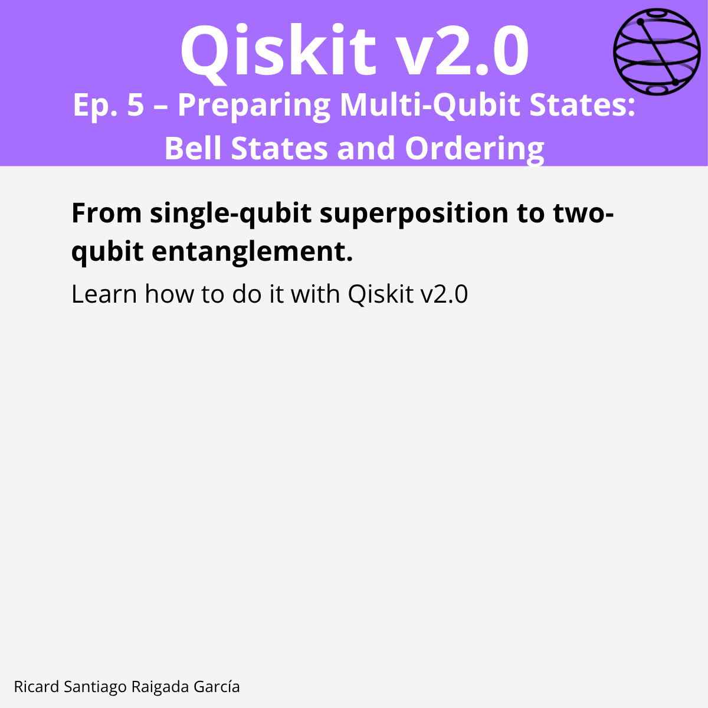

# Episode 5 — Preparing Multi‑Qubit States: Bell States and Ordering

**This episode covers** how to go from a single‑qubit superposition to **two‑qubit entanglement**, build a Bell state with `H` + `CX`, and interpret **bit ordering** (little‑endian) in Qiskit.

## 🎯 Learning goals

- Initialize and reason about multi‑qubit base states like $ |00\rangle $.
- Create a Bell state $ |\Phi^+\rangle = (|00\rangle + |11\rangle)/\sqrt{2} $.
- Understand Qiskit’s **little‑endian** ordering (rightmost bit = qubit 0).
- Visualize two‑qubit states with `plot_state_city`.
- Verify entanglement via reduced‑state **purity** and simulator counts.

---

## 📁 Assets

The **LinkedIn carousel** for this episode is available in the `images/` folder.

---

**Next episode:** Episode 6 — Introduction to the Qiskit Stack
