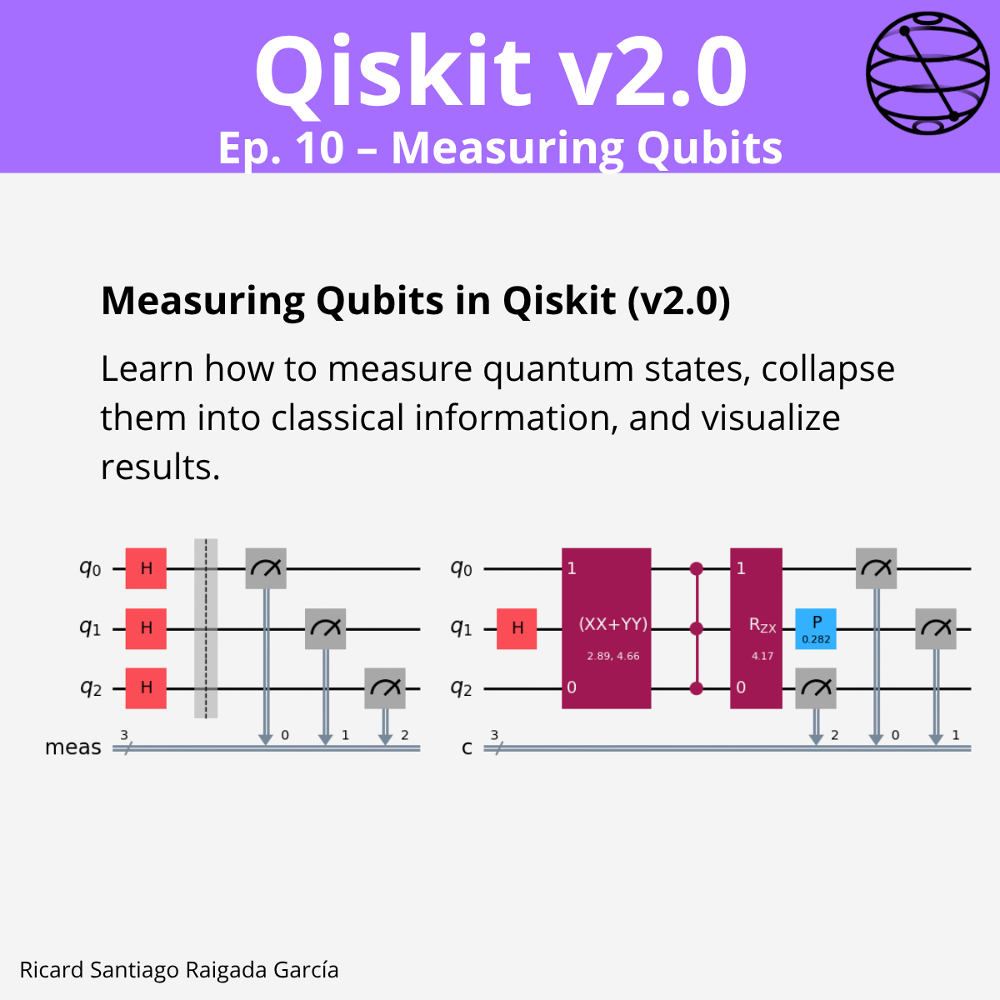

# Ep. 10: Measuring Qubits

This episode covers how to measure quantum states in **Qiskit v2.0**, collapse them into classical information, and visualize results. It also explores advanced measurement techniques, including conditional execution based on measurement outcomes.

## 🎯 Learning goals

- Understand the concept of measurement in Qiskit and its implications on quantum states.  
- Perform single, full, and active qubit measurements.  
- Use the `Measure` class for standalone measurement instructions.  
- Apply conditional measurements with `if_test()` and `if_else()`.  
- Visualize measurement results with histograms.  

---

## 📁 Assets

The **LinkedIn carousel** for this episode is available in the [images/](images/) folder.

---

**Next episode:** Episode 11 — Fractional Gates in Qiskit
