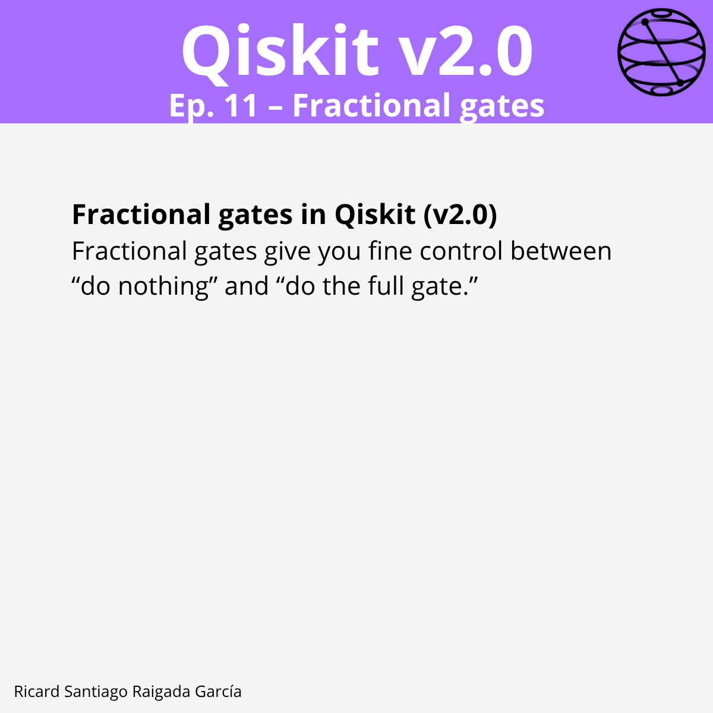

# Ep. 11: Fractional Gates

This episode covers how to use **fractional gates** in Qiskit v2.0 to apply a fraction of a quantum gate’s action, enabling fine-grained rotations, partial entanglement, and smooth control in variational circuits.

## 🎯 Learning goals

- Understand what fractional gates are and how they differ from full gates.  
- Use `.power(p)` to apply a real-valued fraction of any unitary gate.  
- Recognize common named fractional gates like `SX` and `S`.  
- Apply fractional single-qubit rotations (`RX`, `RY`, `RZ`).  
- Create partial entanglement with controlled fractional gates (`CRX`, `CRY`, `CRZ`).  
- Use two-qubit fractional interactions (`RXX`, `RYY`, `RZZ`, `RZX`).  
- Implement programmatic sweeps of fractional parameters.  
- Integrate fractional gates into variational ansätze.  
- Be aware of compilation details and hardware considerations.

---

## 📁 Assets

The **LinkedIn carousel** for this episode is available in the [images/](images/) folder.

---

**Next episode:** Episode 12 — Implementing Classical Feedforward Logic and Conditional Execution
