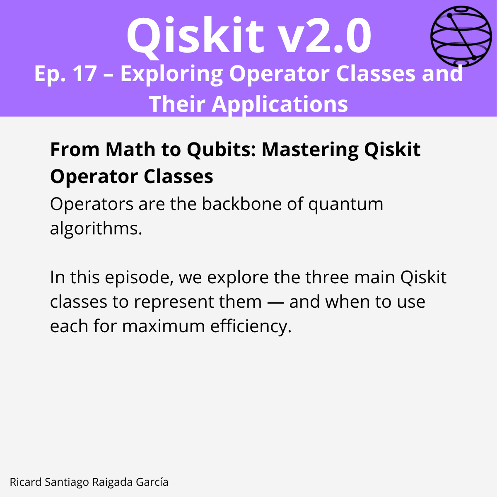

# Episode 17 — Exploring Operator Classes and Their Applications

**This episode covers** how to model quantum observables and linear operators in Qiskit using `SparsePauliOp`, `Pauli`, and `Operator`, including algebra, conversions, and expectation values.

## 🎯 Learning goals

- Choose the right operator type for a task (sparse vs dense).
- Build observables efficiently with `SparsePauliOp.from_sparse_list`.
- Perform arithmetic: add, scale, compose, and tensor operators.
- Convert between `SparsePauliOp`, `Pauli`, and `Operator`.
- Compute expectation values on statevectors for quick validation.
- Implement a small Ising‑type Hamiltonian and verify correctness.

---

## 📁 Assets

The **LinkedIn carousel** for this episode is available in the `images/` folder.

---

**Next episode:** Episode 18 — Measuring Observables in the Pauli Basis
