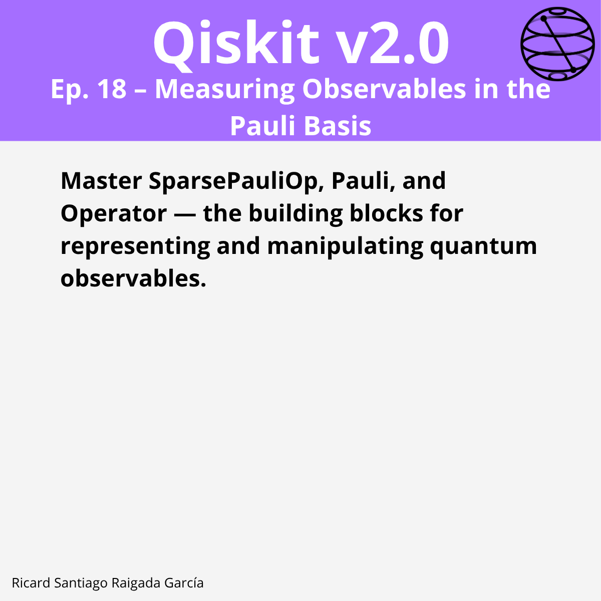

# Episode 18 — Measuring Observables in the Pauli Basis

**This episode covers** how to represent and manipulate quantum operators in Qiskit using `SparsePauliOp`, `Pauli`, and `Operator` classes. You will learn how to build observables and Hamiltonians, perform algebraic operations between operators, convert dense matrices to sparse Pauli form, and measure in different Pauli bases, both manually and with the `Estimator` primitive.

## 🎯 Learning goals

* Represent observables efficiently with `SparsePauliOp`
* Compose, add, scale, and tensor operator objects
* Convert dense matrices to Pauli sums for quantum evaluation
* Understand when to use `Pauli` vs. `SparsePauliOp` vs. `Operator`
* Compute expectation values with `Estimator`
* Measure in X/Y/Z bases via basis-change circuits

---

## 📁 Assets

The **LinkedIn carousel** for this episode is available in the `images/` folder.

---

**Next episode:** Episode 19 — Working with the Operator Class in Depth
