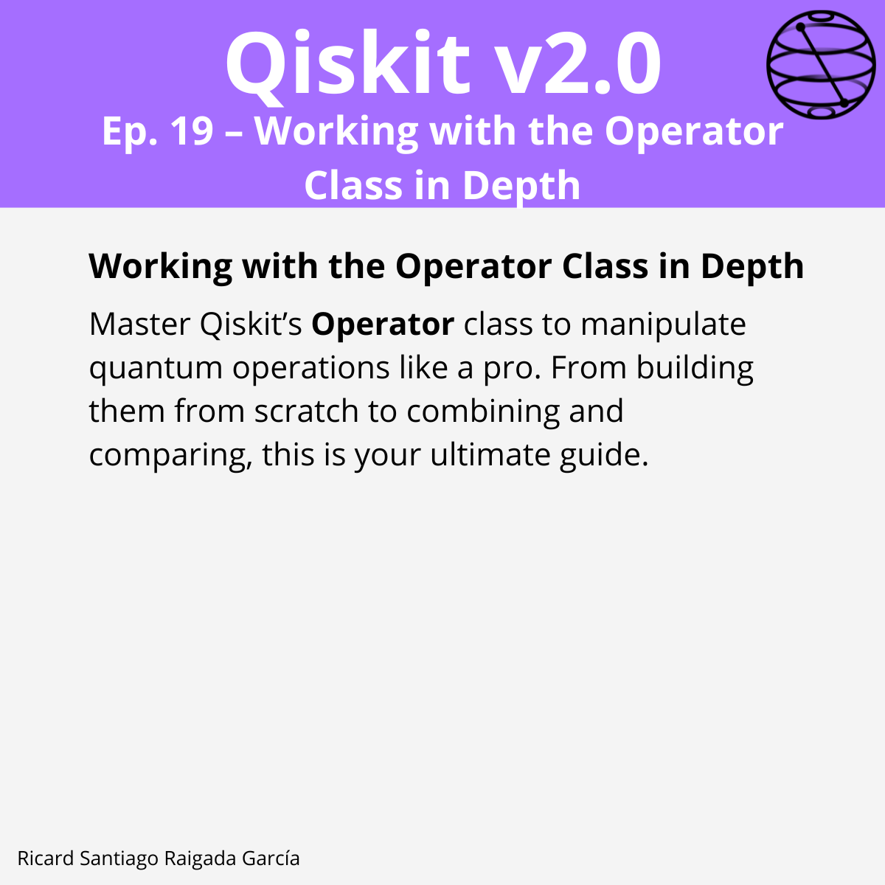

# Episode 19 — Working with the Operator Class in Depth

**This episode covers** how to use Qiskit’s `Operator` class to represent and manipulate dense linear operators for quantum computing. You will learn how to construct `Operator` objects from Pauli strings, gates, and quantum circuits; insert them into circuits; combine them using tensor products, expansions, and compositions; operate on specific subsystems; build linear combinations for observables; and compare operators using equality checks and `process_fidelity`. The episode also covers the implications of unitarity, Hermiticity, and global phase when working with operators.

## 🎯 Learning goals

- Convert `Pauli`, `Gate/Instruction`, and `QuantumCircuit` into `Operator`.
- Insert unitary operators into circuits and validate with `is_unitary()`.
- Combine operators using `tensor`, `expand`, and `compose` (including `qargs` for targeted subsystems).
- Build linear combinations for observables and check Hermiticity vs. unitarity.
- Compare operators via equality and `process_fidelity` (global‑phase insensitive).

---

## 📁 Assets

The **LinkedIn carousel** for this episode is available in the `images/` folder.

---

**Next episode:** Episode 20 — Hardware‑Aware Optimization with the Qiskit Transpiler
