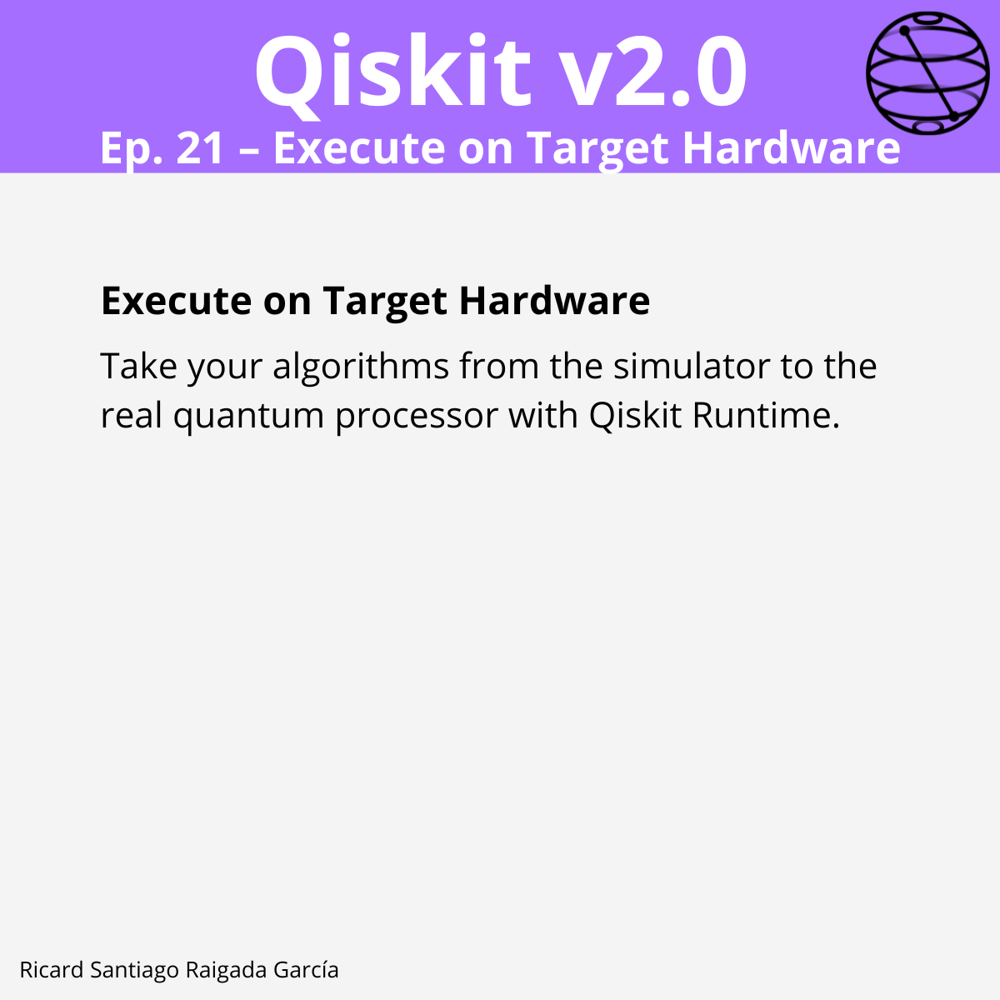

# Episode 21 — Execute on Target Hardware

**This episode covers** how to run your optimized ISA circuits directly on IBM Quantum hardware using Qiskit Runtime primitives. You will learn how to set up your Qiskit Runtime account, choose an appropriate backend, and execute circuits using the `Estimator` and `Sampler` primitives, with modes such as job, batch, and session. This episode also covers configuring runtime options for error suppression and mitigation.

## 🎯 Learning goals

- Connect to IBM Quantum hardware with Qiskit Runtime Service.
- Select the most suitable backend for execution.
- Transpile circuits to ISA-compatible forms.
- Execute using `EstimatorV2` for expectation values.
- Execute using `SamplerV2` for shot-based measurements.
- Understand execution modes: job, batch, session.
- Apply runtime options for improved accuracy.

---

## 📁 Assets

The **LinkedIn carousel** for this episode is available in the `images/` folder.

---

**Next episode:** Episode 22 — Post-process Results
