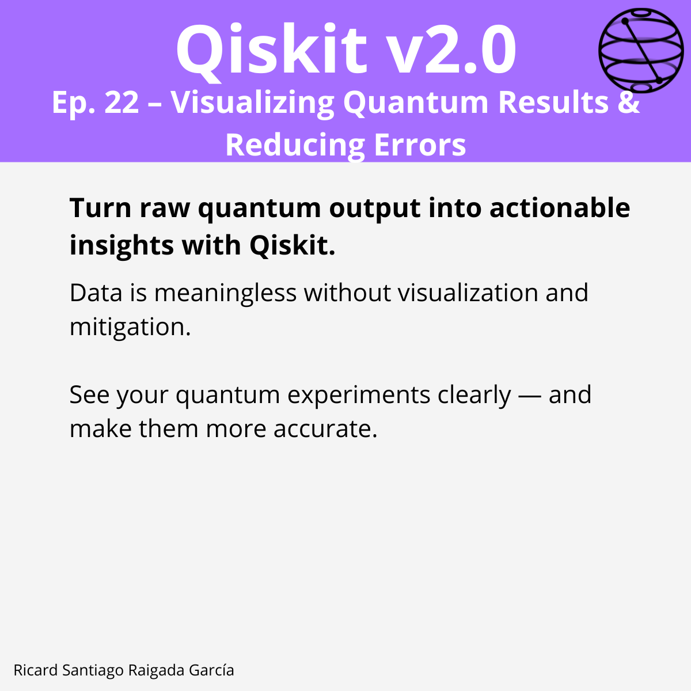

# Episode 22 — Visualize Results and Apply Error Mitigation

**This episode covers** how to visualize quantum computation outcomes using Qiskit’s built-in plotting tools and Matplotlib, including `plot_histogram` for Sampler results and custom bar plots for Estimator results. It also introduces error mitigation techniques in Qiskit IBM Runtime, such as resilience levels, Twirled Readout Error eXtinction (TREX), and Zero Noise Extrapolation (ZNE). You will learn to configure resilience options, apply custom error suppression settings, and use the NoiseLearner helper to characterize hardware noise for improved post-processing accuracy.

## 🎯 Learning goals

- Use `plot_histogram` to visualize quantum measurement outcomes from Sampler runs.
- Customize histograms with legends, colors, ordering, and display options.
- Create bar plots for Estimator results using Matplotlib, including error bars.
- Understand Qiskit IBM Runtime resilience levels and their effect on error mitigation.
- Enable and configure specific error mitigation techniques (TREX, ZNE, gate twirling).
- Perform noise learning with `NoiseLearner` and integrate results into Estimator workflows.

---

## 📁 Assets

The **LinkedIn carousel** for this episode is available in the `images/` folder.

---

**Next episode:** Episode 23 — [Coming Soon]
