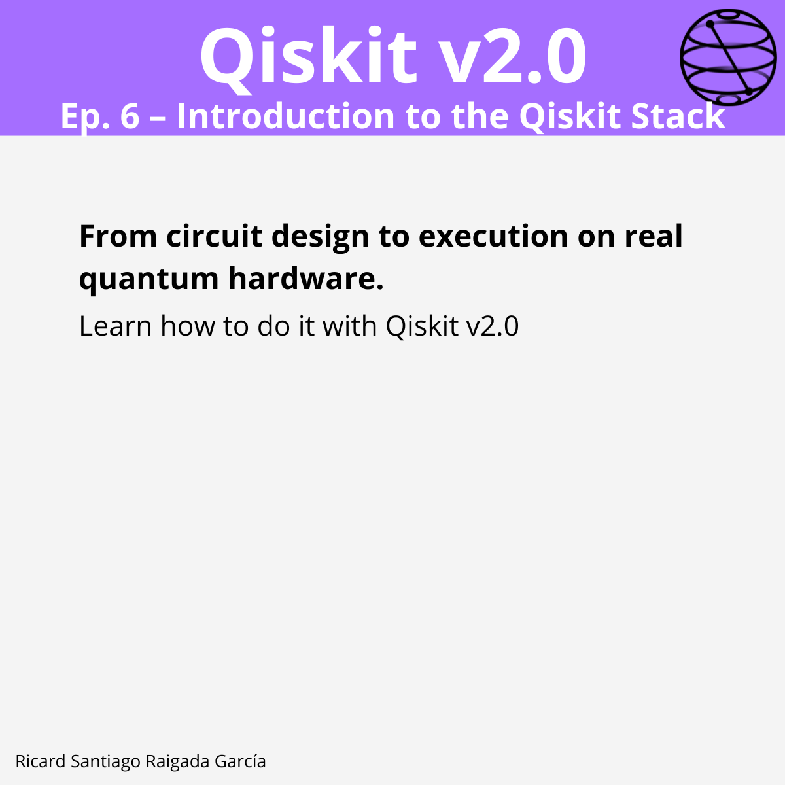

# Ep. 06: Introduction to the Qiskit Stack

This episode covers what “the Core SDK” means in Qiskit v2.0 and how the modular stack fits together to create and run quantum programs (locally and on IBM Quantum Platform).

## 🎯 Learning goals

- Understand the role of the **Qiskit SDK (core library)** in building and manipulating circuits.
- Know when to use **Qiskit Runtime** for cloud execution and managed resources.
- Identify **additional services** (optimization, scaling, research tooling) in the broader Qiskit ecosystem.
- Be able to run a minimal end-to-end workflow: build → transpile → execute → analyze.

---

## 📁 Assets

The **LinkedIn carousel** for this episode is available in the [images/](images/) folder.

---

**Next episode:** Episode 7 — Introduction to Qiskit Patterns
