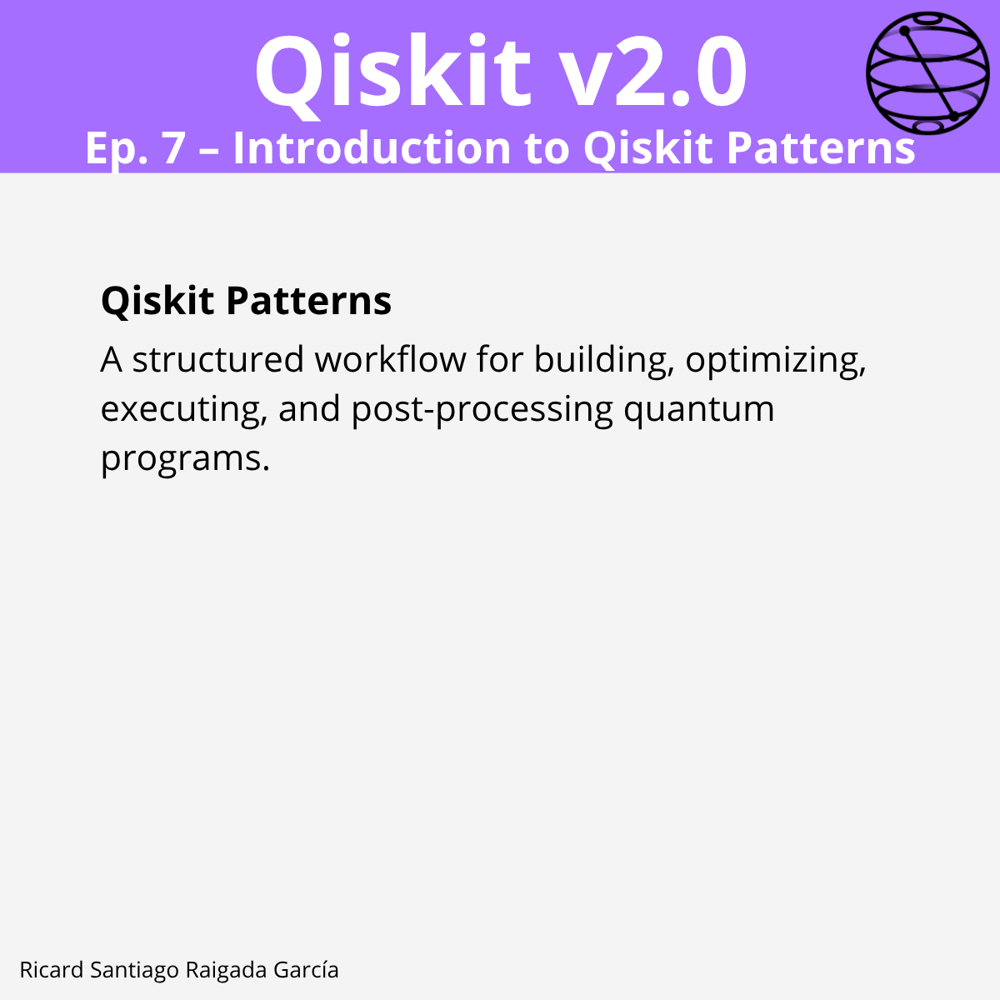

# Ep. 07: Introduction to Qiskit Patterns

This episode covers the concept of **Qiskit Patterns** — a structured and repeatable workflow for building, optimizing, executing, and post-processing quantum programs, enabling smooth integration of new tools and services, and adaptable for local, cloud, or Qiskit Serverless execution.

## 🎯 Learning goals

* Understand why patterns matter in quantum workflows.
* Learn the structure and steps of a Qiskit Pattern.
* Map classical problems to quantum form.
* Optimize circuits for specific target hardware.
* Execute quantum programs on hardware using Qiskit Runtime primitives.
* Post-process and interpret quantum results.

---

## 📁 Assets

The **LinkedIn carousel** for this episode is available in the [images/](images/) folder.

---

**Next episode:** Episode 8 — Using the Qiskit Circuit Library
