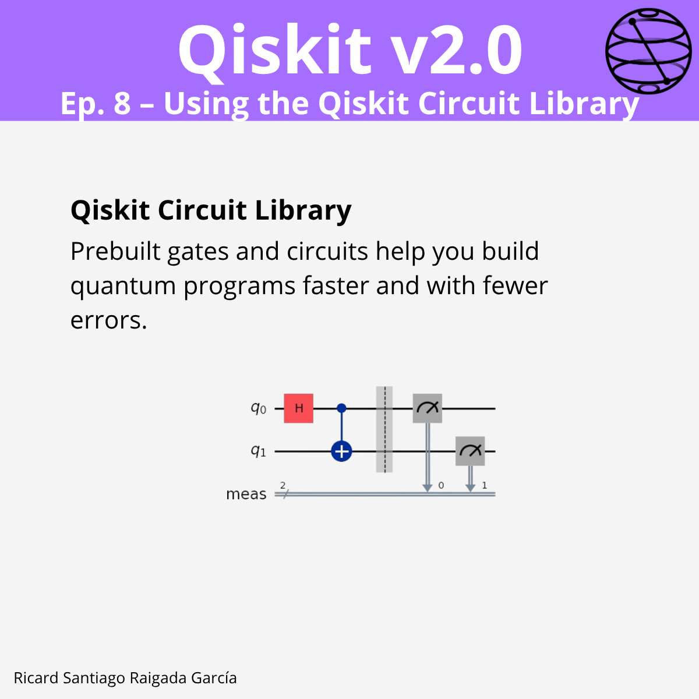

# Ep. 08: Using the Qiskit Circuit Library

This episode covers how to use **Qiskit’s Circuit Library** — a collection of prebuilt, tested, and modular quantum gates and circuits that speed up development, keep your code clean, and reduce implementation errors.

## 🎯 Learning goals

- Understand what the Qiskit Circuit Library is and its benefits.  
- Learn to import and use prebuilt gates and circuits.  
- Use parameterized gates for flexibility and reuse.  
- Integrate library gates with custom gates to build complex quantum programs.  
- Reuse subcircuits and build hierarchical quantum workflows.  

---

## 📁 Assets

The **LinkedIn carousel** for this episode is available in the [images/](images/) folder.

---

**Next episode:** Episode 9 — Constructing Circuits Programmatically
