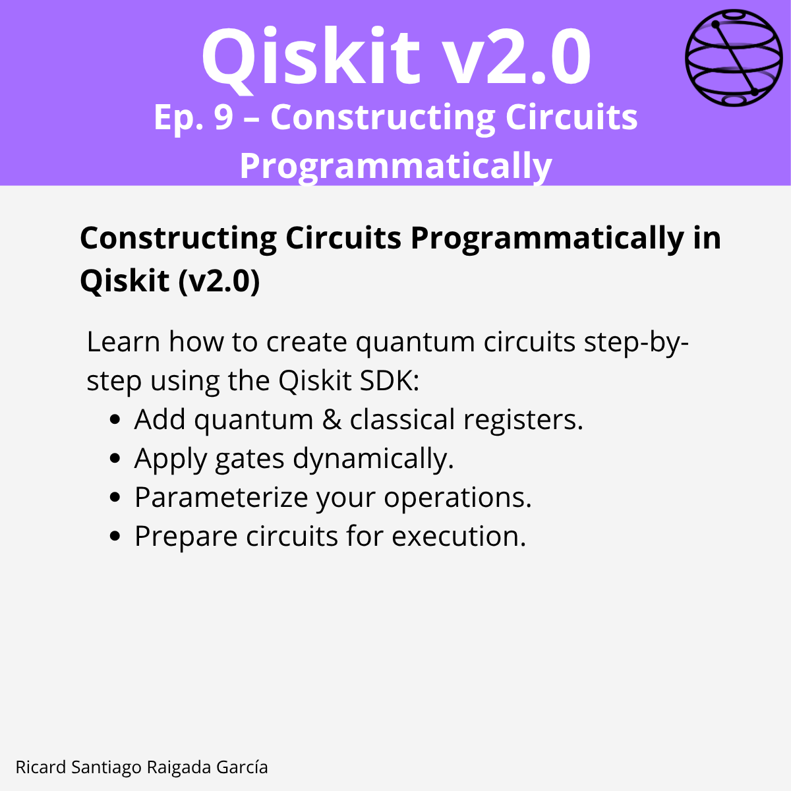

# Ep. 09: Constructing Circuits Programmatically

This episode covers how to create quantum circuits step-by-step using the **Qiskit v2.0 SDK**, including adding registers, applying gates dynamically, parameterizing operations, combining subcircuits, and integrating simulators for visualization.

## 🎯 Learning goals

- Add quantum and classical registers to a circuit.  
- Apply gates manually or programmatically using loops.  
- Use parameterization to make circuits reusable and adaptable.  
- Build and integrate subcircuits into larger workflows.  
- Visualize circuit results with simulators.  
- Prepare circuits for execution on simulators or hardware.

---

## 📁 Assets

The **LinkedIn carousel** for this episode is available in the [images/](images/) folder.

---

**Next episode:** Episode 10 — Measuring Qubits in Qiskit
